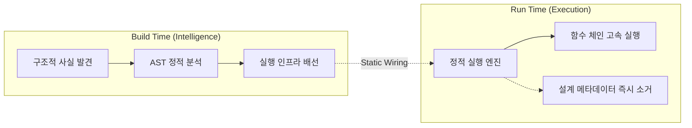
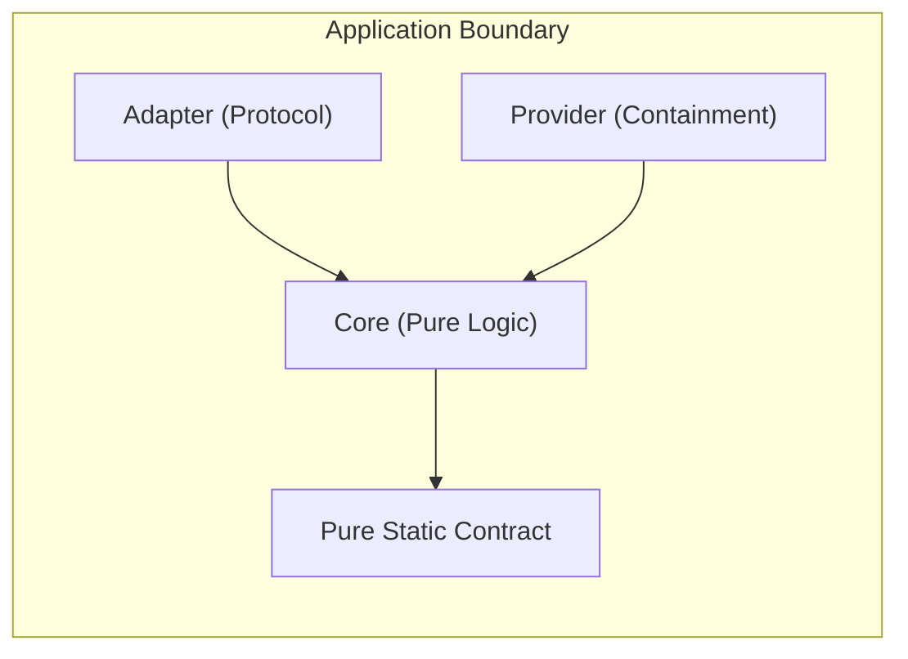
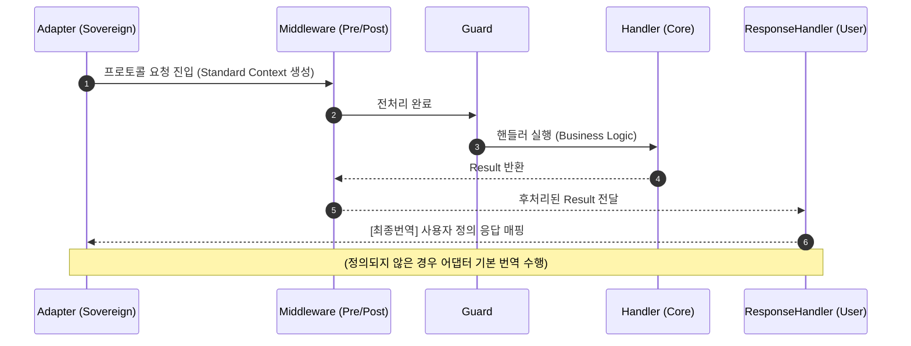
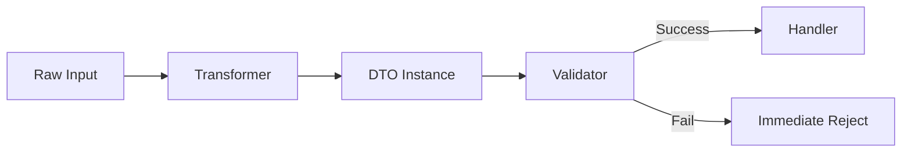
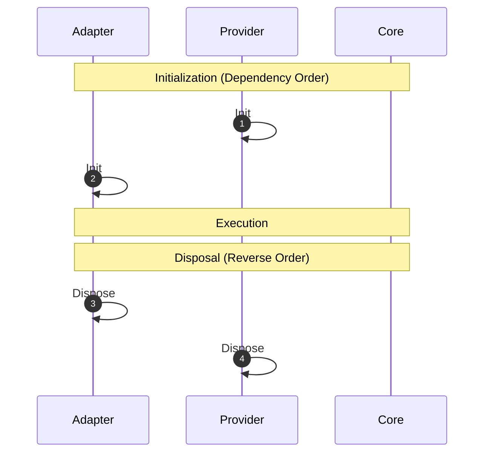

# Bunner 아키텍처 헌법 (Level 2)

> **L2 – Architecture (Structural Boundary)**
>
> 이 문서는 Bunner 프레임워크의 구조적 불변성(Invariants), 의존성 방향, 그리고 데이터 무결성을 정의하는 **최상위 아키텍처 명세서**입니다.
>
> 본 문서는 **[SSOT_HIERARCHY](../10_FOUNDATION/SSOT_HIERARCHY.md)** 에 따라 **L1(기술적 불변식)** 을 계승하며, 모든 **L3(기능 명세)** 의 상위 권위를 가집니다.
> L1의 물리 법칙 하에서 시스템이 어떻게 구성되는지를 정의하는 구조적 지도입니다.

---

## 1. 지능의 국소성 (Intelligence Locality)

Bunner 아키텍처의 제1원칙은 **"지능의 국소화"** 입니다. 시스템의 복잡한 추론과 판단은 빌드 타임에 집중되며, 런타임은 확정된 사실만을 실행합니다. 이는 **L1 Invariants #1 (Platform & Intelligence Locality)** 의 직접적인 실현입니다.

### 1.1 Exclusive Bun Platform

이 아키텍처는 **Bun 런타임** 의 고속 실행 모델을 절대 전제로 합니다. Node.js 호환성 유지를 위한 구조적 타협은 존재하지 않으며, 모든 설계는 Bun의 네이티브 성능을 극대화하는 방향으로 수렴합니다.

### 1.2 Brainless Execution with Context

- **CLI / Compiler (The Brain):** 프레임워크의 유일한 지능 계층입니다. AST 정적 분석을 통해 구조적 사실(Structural Facts)을 발견하고, 실행 인프라(Infrastructure)를 구축합니다. 이 과정에서 추측(Heuristics)은 배제되며, 오직 **명시적 마커(Explicit Marker)** 만이 식별 근거로 사용됩니다.
- **Runtime (The Body):** 지능이 거세된 결정론적 실행 엔진입니다. 사용자는 **엔진의 실행 메커니즘을 후킹하거나 교체할 수 없으며(Immutable Engine)**, 오직 정적 배선된 함수 체인을 고속 실행하는 역할에 집중합니다.
- **Structural Context Injection:** 런타임은 무지능(Brainless)이지만, CLI가 빌드 타임에 주입한 **좌표(Coordinate)** 를 통해 리플렉션 없이도 자신의 구조적 위치를 인지합니다. 이때 `Error.stack` 등을 통한 **역추적(Back-tracing) 컨텍스트 생성은 물리적으로 금지** 됩니다.
- **Metadata Volatility:** 설계 메타데이터는 부트스트랩 완료 직후 메모리에서 즉시 소거(Cleanup)되어야 합니다. 실행 중 설계 정보에 접근하여 구조를 변경하려는 모든 시도는 물리적으로 차단됩니다.

---

## 2. 경로 정체성과 모듈성 (Path Identity & Modularity)

Bunner의 모든 신원과 경계는 파일 시스템의 물리적 구조에 의해 결정론적으로 정의됩니다. 이는 **L1 Invariants #2 (Structural & Discovery Invariants)** 를 따릅니다.

### 2.1 Directory-First Modularity

- **Filesystem is the Tree:** 별도의 모듈 등록 코드는 존재하지 않습니다. 모듈 정의 파일이 존재하는 디렉토리가 곧 모듈 루트가 됩니다.
- **Implicit Absorption:** 모듈 정의 파일이 없는 디렉토리의 컴포넌트들은 명시적 선언 없이 가장 가까운 상위 모듈로 자동 흡수됩니다.

### 2.2 Zero-Config Wiring

- **Import as Declaration:** 다른 모듈의 기능을 사용하기 위해 `imports` 배열을 작성할 필요가 없습니다. 표준 JS/TS `import` 구문 자체가 의존성 선언으로 해석됩니다.
- **Static Resolution:** CLI는 이 `import`를 분석하여 빌드 타임에 모듈 간 의존성 그래프를 자동으로 확정합니다.

### 2.3 Normalized Path Key

- 모든 컴포넌트와 모듈의 유일성(Identity)은 **정규화된 파일 경로(Normalized Physical Path)** 로만 식별됩니다.
- Path Alias나 심볼릭 링크는 모두 물리 경로로 치환되어, 단 하나의 물리적 신뢰 경로(SSOT)가 확정됩니다.

### 2.4 Visibility Barrier (Encapsulation)

- 모듈 경계는 단순한 폴더 구분이 아닌 **"가시성 장벽(Visibility Barrier)"** 입니다.
- `Internal` 선언된 컴포넌트는 물리적으로 다른 모듈에서의 접근이 차단됩니다. 아키텍처는 이를 통해 모듈 간의 우발적 결합을 빌드 타임에 원천 봉쇄합니다.

---

## 3. 계층적 격리 (Layered Quarantine)

시스템은 관심사의 지속 시간에 따라 계층을 엄격히 분리하며, 상위 계층은 하위 계층의 불확실성으로부터 보호받아야 합니다. 이는 **L1 Invariants #3 (Decoupling & Agnosticism)** 을 따릅니다.

- **Protocol-Agnostic Core:** 비즈니스 코어(Core)는 자신이 어떤 프로토콜(HTTP, WebSocket 등) 위에서 구동되는지 인지할 수 없습니다. 어댑터(Adapter)는 프로토콜 요청을 **'표준 컨텍스트(Standard Context)'** 로 번역하여 코어에 주입할 책임을 가집니다.
- **Adapter Isolation (Multi-Adapter):** 각 어댑터는 서로의 존재를 모른 채 독립적으로 동작합니다. 어댑터 간 협력은 반드시 코어를 통해서만 가능합니다.
- **Pure Static Contract Layer:** 최상위 계약 계층은 실행 로직이 전무하며, 오직 **타입(Type)과 마커(Marker)** 만을 포함해야 합니다. 런타임 의존성이 0이어야 하며, 모든 계층이 의존하는 순수 계약 집합입니다.
- **Provider Containment:** 프로바이더는 외부 라이브러리나 상수 등 **"외부의 불확실성을 Bunner의 결정적 시스템 안으로 가두어 통제하는 관문"** 입니다.

---

## 4. 어댑터 주권과 파이프라인 (Adapter Sovereignty & Pipeline)

Bunner는 런타임 엔진이 고정된 파이프라인 시퀀스를 강제하지 않습니다. **Adapter**가 자신의 프로토콜 특성에 가장 적합한 라이프사이클과 실행 위계를 완전히 소유합니다.

### 4.1 Pipeline Ownership & Multi-Adapter

- **Pipeline Ownership:** 어댑터는 자신의 스코프 내에서 미들웨어(Middleware), 가드(Guard), 핸들러(Handler)의 배치 순서를 결정합니다.
- **Multi-Adapter Capability:** 하나의 애플리케이션에서 HTTP 서버와 WebSocket 리스너가 동시에 구동될 수 있으며, 이들은 코어 로직을 공유하면서도 독립된 파이프라인을 가집니다.

### 4.2 Static Capability Evaluation (정적 기능 판정)

- **Capability Evaluation:** 어댑터가 선언한 기능(Capability)은 단순한 주장이 아니라, CLI에 의해 **빌드 타임에 구조적으로 판정(Computed at Build-Time)** 됩니다. 구조적 한계를 넘는 자동화나 편의 기능은 거부됩니다.

### 4.3 Adapter Dependency & Attachment

- **Standalone Mode:** 어댑터가 독립적으로 리스너를 생성하고 구동하는 모드입니다.
- **Dependent Mode:** 어댑터가 다른 어댑터를 매개체(Host)로 사용하여 실행되는 모드입니다. 이때 프레임워크는 어댑터 간의 정적 의존성(Dependency)과 결합(Attachment)만을 관리하며, 물리적 포트 공유 등의 운영 토폴로지는 검증하지 않습니다.

### 4.3 Response Sovereignty

- **ResponseHandler:** Domain(Result)과 Protocol(Response) 사이의 최종 번역 책임을 사용자가 대행하는 주권적 지점입니다.

---

## 5. 데이터 무결성 사슬 (Data Integrity Chain)

코어는 외부로부터 유입되는 오염된 데이터에 직접 노출되지 않습니다. 모든 입력 데이터는 핸들러(Handler)에 도달하기 전 반드시 다음의 불가역적 검역 위계를 충족해야 합니다. 이는 **L1 Invariants #5 (Data & Flow Invariants)** 를 따릅니다.

이 모든 과정은 **Zero Runtime Overhead**를 지향하며, AOT 컴파일러가 생성한 최적화된 코드로 수행됩니다.

1.  **Transformer (엔트로피 정제):** 외부 Raw 데이터를 읽어 선언적 규칙에 따라 순수한 **DTO 인스턴스** 로 매핑 및 신원을 부여합니다.
2.  **DTO (신원 및 스키마):** 데이터 구조의 유일한 진실(SSOT)이며, 비즈니스 로직이 없는 **Anemic Data Model** 입니다.
3.  **Validator (물리적 장벽):** 생성된 DTO 인스턴스의 불변식을 물리적으로 검증합니다. 실패 시 비즈니스 로직 진입 전 즉시 차단(Fail-Fast)하며, 이는 필터 체인을 거치지 않는 물리적 거부입니다.

> **검역 원칙:** `외부 데이터(Raw) -> Transformer -> DTO -> Validator -> Handler`. 이 순서는 절대적이다.

---

## 6. 라이프사이클 및 역순 해제 (Deterministic Lifecycle)

자원의 획득과 반납은 시스템의 의존성 위계에 따라 결정론적으로 관리됩니다. 이는 **L1 Invariants #4 (Immutability & Volatility)**, **#6 (Defense & Failure)** 를 따릅니다.

> **Acyclic Dependency Law:** 이 모든 결정론적 순서의 수학적 전제 조건은 **"비순환 의존성 그래프(DAG)"** 입니다. 순환 참조(Circular Dependency)가 존재하는 구조는 빌드 타임에 기각됩니다.

- **Initialization:** 의존성 그래프의 하위 노드(Provider/Adapter)부터 상위 노드 순으로 초기화됩니다. 모든 컴포넌트는 기본적으로 **싱글톤(Default Singleton)** 토폴로지를 가지며, **Fail-Fast Startup** 원칙에 따라 초기화 중 실패는 즉시 프로세스 종료로 이어집니다.
- **Reverse-Order Disposal:** 시스템 종료 시 자원 해제는 반드시 **의존성 그래프의 정확한 역순**으로 수행되어야 합니다. 이는 상위 계층이 하위 계층의 자원을 안전하게 사용하다가 마무리할 수 있도록 보장하는 안정성 원칙입니다.

---

## 7. 실패의 이원화 (Failure Duality)

프레임워크는 실패를 두 가지 차원에서 엄격히 관철하여 관리하며, 각 차원은 서로 다른 제어 흐름을 따릅니다. 이는 **L1 Invariants #6 (Defense & Failure)** 를 따릅니다.

### 7.1 도메인 실패 (Business Result)

- 잔액 부족, 중복 가입 등 예측 가능한 비즈니스 실패는 예외(`throw`)가 아닌 **`Result` 객체** 를 통해 반환됩니다.
- 이는 정상적인 실행 흐름의 일부(Control Flow)로 간주됩니다.

### 7.2 시스템 패닉 (System Exception)

- DB 연결 단절, 널 참조, 코드 버그 등 예기치 못한 장애는 **`Exception`** 으로 취급됩니다.
- 시스템 패닉은 단일화된 **Unified Error Filter Chain** 을 통해서만 포착 및 응답으로 환원됩니다.

### 7.3 All is Filter

- **"모든 시스템 에러 처리는 필터다."** 별도의 복구 경로(Recovery Path)는 존재하지 않습니다.
- 필터 체인의 끝에는 **Default Framework Error Filter** 가 존재하여, 처리되지 않은 패닉을 잡아내고 시스템을 안전하게 종료하거나 에러 응답을 반환하는 최후의 보루 역할을 수행합니다.

### 7.4 Prohibition of Ad-Hoc Recovery

- **No Manual Try-Catch:** 인프라 레벨의 제어를 위해 사용자가 임의로 `try-catch`를 작성하여 예외를 삼키거나 변형하는 행위는 금지됩니다. 모든 복구 로직과 정책은 오직 **필터(Filter)** 에 위임되어야 합니다.

---

## 8. 클러스터와 실행 토폴로지 (Cluster & Execution Topology)

Bunner에서 클러스터와 워커 관리는 비즈니스 로직(Core)의 일부가 아닌, **운영을 위한 실행 환경**으로 정의됩니다.

### 8.1 Cluster Manager Responsibility

- 클러스터 매니저는 요청 처리에 개입하지 않으며, 오직 실행 단위(Worker)의 **생명주기(Spawn/Respawn/Draining)** 만을 관리합니다.
- 워커 간 통신과 동기화는 요청 처리 로직과 엄격히 분리된 별도의 채널을 통해 수행되어야 합니다.

### 8.2 Worker Placement Models

사용자의 운영 전략에 따라 다음 두 가지 워커 배포 모델을 모두 지원합니다. 이는 프레임워크가 강제하지 않는 사용자 설정 영역입니다.

- **All-Adapters-Per-Worker:** 모든 워커가 동일한 어댑터 집합을 구동하는 기본 모델.
- **Worker Groups:** 어댑터별로 리소스를 격리하기 위해 워커 그룹마다 다른 어댑터 집합을 구동하는 모델. (예: API 워커 그룹 vs 배치 워커 그룹 분리)

---

## 9. 설정의 불변성 (Configuration Immutability)

### 9.1 Pre-Execution Phase

설정(Configuration)은 애플리케이션의 일부가 아니라, 애플리케이션이 생성되기 위한 **전제 조건(Prerequisite)** 입니다. 설정 로딩은 반드시 실행 전 단계에서 완료되어야 합니다. 또한, 루트 모듈의 설정은 전역으로 전파(Root-to-Global Propagation)되며, 하위 모듈은 이를 상속받는 위계 구조를 가집니다.

### 9.2 Fail-Fast Loading

- 런타임에 설정을 읽어오거나 보정하는 행위는 금지됩니다.
- 필요한 설정값이 없거나 유효하지 않은 경우, 시스템은 경고 없이 **즉시 시작 불가(Fail-Fast)** 상태로 종료되어야 합니다. "시작 후 문제를 발견"하는 방식은 허용되지 않습니다.

---

## 10. 환경 이원화와 관측성 (Environment Duality & Observability)

Bunner는 **개발 환경(Development)** 과 **배포 환경(Production)** 이 서로 다른 아키텍처 목표를 가진다고 정의합니다.

### 10.1 Two Goals In Conflict

- **Development Goal (Max Info):** 개발 환경은 **이해 가능성(Understandability)** 이 최우선입니다. 모든 디버깅 정보, 소스맵, 메타데이터가 보존되어야 하며, 시스템 내부가 투명하게 관측되어야 합니다.
- **Production Goal (Min Info):** 배포 환경은 **안정성과 효율성(Stability & Efficiency)** 이 최우선입니다. 실행에 불필요한 모든 메타데이터와 설계 정보는 **물리적으로 소거(Stripping)** 되어야 합니다.

### 10.2 Tooling Separation

- **Execution Engine:** CLI와 런타임은 오직 **실행과 빌드** 에 집중합니다. 무거운 시각화나 분석 로직을 포함하지 않습니다.
- **Observability Tools:** 파이프라인 시각화, 의존성 그래프 탐색 등은 별도의 **관측 도구(Visualization Tools)** 영역으로 격리됩니다. 실행 엔진은 관측 도구가 읽을 수 있는 데이터(Artifact)를 제공할 뿐, 관측 로직을 내재화하지 않습니다.
